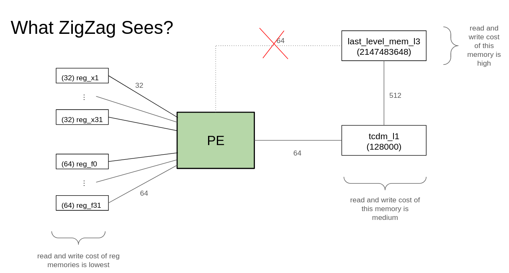

# Modeling Snitch with ZigZag

- Slides documenting meeting with Arne here: https://docs.google.com/presentation/d/10FmwrGjfX_vCTzLIaax1-P3noyZt-mBmsBh1Ad-S9Qo/edit?usp=sharing

- Slides documenting subsequent work here: https://docs.google.com/presentation/d/1Kj0Oa_DfxdGLUCwZZA-Q0Mc5MStBUpIYirP0-M6Gj1M/edit?usp=sharing

## Single Compute Core

I tried to model snitch compute core like this, omitting the 64 bit connection from L3 to the PE:



To make it even simpler, I only add one 32 bit register, x1.

- [yaml hardware description](zigzag/inputs/hardware/emily-snitch-riscv32imafd.yaml)
- [yaml mapping description](zigzag/inputs/mapping/emily-snitch-cc-mapping.yaml)
- [yaml workload description](emily-workload.yaml)
- [main file to run zigzag](emily-run_zigzag.py)

I try to run zigzag with:
```
python emily-run_zigzag.py 
```

But I get the error:
```
2024-06-24 11:17:36,767 - run +44 - INFO - Processing  matmul_104_104...
2024-06-24 11:17:36,767 - run +89 - INFO - matmul_104_104: Launching spatial mapping 1/1 :{D1: {A: 1}}.
100%|████████████████████████████████████████████████████████████████████████████████████| 720/720 [00:00<00:00, 12176.86it/s]
Traceback (most recent call last):
  File "/home/hoppip/zigzag/emily-run_zigzag.py", line 13, in <module>
    answers = zigzag.api.get_hardware_performance_zigzag(workload, accelerator, mapping, "latency", "emily-zigzag-outputs/","emily-zigzag-outputs/list_of_cmes.pickle")
              ^^^^^^^^^^^^^^^^^^^^^^^^^^^^^^^^^^^^^^^^^^^^^^^^^^^^^^^^^^^^^^^^^^^^^^^^^^^^^^^^^^^^^^^^^^^^^^^^^^^^^^^^^^^^^^^^^^^^^^^^^^^^^^^^^^^^^^^^^^^^^^^^^^^^^^^^^
  File "/home/hoppip/zigzag/zigzag/api.py", line 104, in get_hardware_performance_zigzag
    cmes = mainstage.run()
           ^^^^^^^^^^^^^^^
  File "/home/hoppip/zigzag/zigzag/stages/MainStage.py", line 17, in run
    for cme, extra_info in self.list_of_callables[0](self.list_of_callables[1:], **self.kwargs).run():
  File "/home/hoppip/zigzag/zigzag/stages/WorkloadParserStage.py", line 28, in run
    for cme, extra_info in sub_stage.run():
  File "/home/hoppip/zigzag/zigzag/stages/AcceleratorParserStage.py", line 26, in run
    for cme, extra_info in sub_stage.run():
  File "/home/hoppip/zigzag/zigzag/stages/save_stages.py", line 80, in run
    for cme, extra_info in substage.run():
  File "/home/hoppip/zigzag/zigzag/stages/save_stages.py", line 128, in run
    for cme, extra_info in substage.run():
  File "/home/hoppip/zigzag/zigzag/stages/reduce_stages.py", line 130, in run
    for cme, extra_info in substage.run():
  File "/home/hoppip/zigzag/zigzag/stages/WorkloadStage.py", line 46, in run
    for cme, extra_info in sub_stage.run():
  File "/home/hoppip/zigzag/zigzag/stages/VisualizationStage.py", line 33, in run
    for cme, extra_info in substage.run():
  File "/home/hoppip/zigzag/zigzag/stages/save_stages.py", line 33, in run
    for cme, extra_info in substage.run():
  File "/home/hoppip/zigzag/zigzag/stages/reduce_stages.py", line 70, in run
    for cme, extra_info in substage.run():
  File "/home/hoppip/zigzag/zigzag/stages/SpatialMappingGeneratorStage.py", line 114, in run
    for cme, extra_info in spatial_mapping_conversion_stage.run():
  File "/home/hoppip/zigzag/zigzag/stages/SpatialMappingConversionStage.py", line 56, in run
    for cme, extra_info in sub_stage.run():
  File "/home/hoppip/zigzag/zigzag/stages/reduce_stages.py", line 70, in run
    for cme, extra_info in substage.run():
  File "/home/hoppip/zigzag/zigzag/stages/LomaStage.py", line 40, in run
    for temporal_mapping in engine.run():
  File "/home/hoppip/zigzag/zigzag/opt/loma/LomaEngine.py", line 106, in run
    raise NoValidLoopOrderingFoundException(
zigzag.opt.loma.LomaEngine.NoValidLoopOrderingFoundException: No valid loop ordering was found for layer matmul_104_104. Please make sure the spatial mapping is compatible with the architecture.
```

**What am I doing wrong?**

## Cluster

