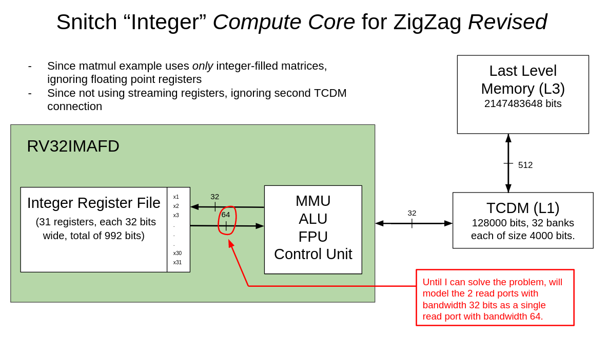
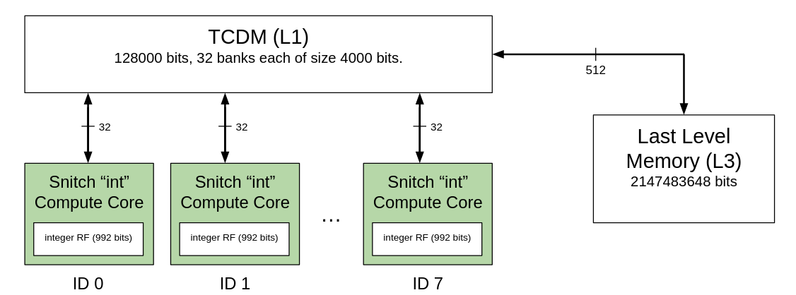
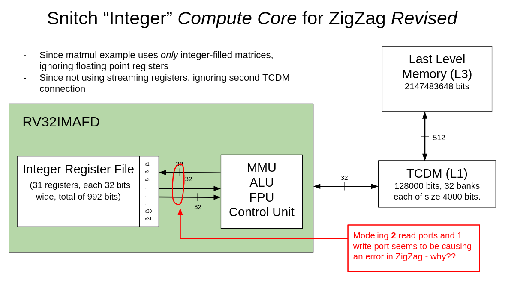

# Modeling Snitch with ZigZag

- [ZigZag Integration Status](https://docs.google.com/presentation/d/1-YQwx20RkEFZoqrMr_WQOjtFaXDR8e_lfNbEfbl83HA/edit#slide=id.p)
- Slides documenting meeting with Arne [here](https://docs.google.com/presentation/d/10FmwrGjfX_vCTzLIaax1-P3noyZt-mBmsBh1Ad-S9Qo/edit#slide=id.p)
- Slides documenting subsequent work [here](https://docs.google.com/presentation/d/1Kj0Oa_DfxdGLUCwZZA-Q0Mc5MStBUpIYirP0-M6Gj1M/edit?usp=sharing)
- Slides documenting 2nd meeting with Arne [here](https://docs.google.com/presentation/d/1ow0q8QFyVJV0ZxhkWge3YxJtolizrXYspLbFo4W4zH0/edit?usp=sharing)

### Questions

**ZigZag**

- Why doesn't ZigZag find lowest latency regardless of default mapping?
- Is it normal to have a spatial mapping with unroll dimension of 1 in my output?
- what does  `core_allocation: [1]` in ZigZag mean? Isn't their only ever one accelerator/core that ZigZag knows about?
- Is there a way to model the snitch compute core's second connection to L3?
- What if I have both integer and floating point operations? How do I model both register files?
  **Stream**
- Stream should give mapping output in a computational node basis, right? Will it look like the temporal and spatial mappings produced by ZigZag?
- What about layer fusion? How does stream use ZigZag for tiling when it also fuses layers? Doesn't ZigZag require perfectly nested loops?
- What about edge cases of tiles? If the the matrix size is not divisible by the tile size, will ZigZag always assume padding and round up?

## multilayer on Snitch Cluster (suggest unrolling K) Latency: 3.137e+07

- [Hardware Description](zigzag/inputs/hardware/snitch-cluster-only-integers.yaml)

- using [resnet18-trimmed.yaml](zigzag/inputs/workload/resnet18-trimmed.yaml) for the input workload

- [Default Mapping File](zigzag/inputs/mapping/emily-snitch-cluster-multilayer-mapping.yaml):

  ```
  - name: default
    core_allocation: [1]
    spatial_mapping:
      D1:
        - B, 1
      D2:
        - K, 8
    temporal_ordering:
      - [B, 112]
      - [K, 14]
      - [C, 112]
      - [OY, 112]
      - [OX, 112]
      - [FY, 112]
      - [FX, 112]
    memory_operand_links:
      O: O
      W: I2
      I: I1
  # unroll K
  ```

```
python main_snitch_cluster_only_integers_multilayer.py
```

Output:

```
Loop ordering for example_name_of_layer0
==============================================================================================
Temporal Loops                       I                  O                  W                  
==============================================================================================
for OX in [0, 112):                  l3                 l3                 l1                 
----------------------------------------------------------------------------------------------
  for OY in [0, 112):                l1                 l1                 l1                 
----------------------------------------------------------------------------------------------
    for FX in [0, 7):                l1                 rf_x1_thru_x31     l1                 
----------------------------------------------------------------------------------------------
      for FY in [0, 7):              rf_x1_thru_x31     rf_x1_thru_x31     l1                 
----------------------------------------------------------------------------------------------
        for C in [0, 3):             rf_x1_thru_x31     rf_x1_thru_x31     rf_x1_thru_x31     
----------------------------------------------------------------------------------------------
          for K in [0, 8):           rf_x1_thru_x31     rf_x1_thru_x31     rf_x1_thru_x31     
----------------------------------------------------------------------------------------------
==============================================================================================
Spatial Loops                                                                                 
==============================================================================================
            parfor K in [0, 8):                                                               
----------------------------------------------------------------------------------------------
            parfor B in [0, 1):                                                               
----------------------------------------------------------------------------------------------


Loop ordering for Layer1
============================================================================================
Temporal Loops                     I                  O                  W                  
============================================================================================
for OX in [0, 8):                  l3                 l3                 rf_x1_thru_x31     
--------------------------------------------------------------------------------------------
  for G in [0, 64):                l3                 l3                 rf_x1_thru_x31     
--------------------------------------------------------------------------------------------
    for OX in [0, 7):              l1                 l1                 rf_x1_thru_x31     
--------------------------------------------------------------------------------------------
      for FY in [0, 3):            l1                 rf_x1_thru_x31     rf_x1_thru_x31     
--------------------------------------------------------------------------------------------
        for OY in [0, 56):         l1                 rf_x1_thru_x31     rf_x1_thru_x31     
--------------------------------------------------------------------------------------------
          for FX in [0, 3):        rf_x1_thru_x31     rf_x1_thru_x31     rf_x1_thru_x31     
--------------------------------------------------------------------------------------------
============================================================================================
Spatial Loops                                                                               
============================================================================================
            parfor B in [0, 1):                                                             
--------------------------------------------------------------------------------------------


Loop ordering for Layer2
==============================================================================================
Temporal Loops                       I                  O                  W                  
==============================================================================================
for OX in [0, 56):                   l3                 l3                 l1                 
----------------------------------------------------------------------------------------------
  for K in [0, 8):                   l1                 l3                 l1                 
----------------------------------------------------------------------------------------------
    for FX in [0, 3):                l1                 rf_x1_thru_x31     l1                 
----------------------------------------------------------------------------------------------
      for C in [0, 64):              l1                 rf_x1_thru_x31     l1                 
----------------------------------------------------------------------------------------------
        for FY in [0, 3):            l1                 rf_x1_thru_x31     rf_x1_thru_x31     
----------------------------------------------------------------------------------------------
          for OY in [0, 56):         l1                 rf_x1_thru_x31     rf_x1_thru_x31     
----------------------------------------------------------------------------------------------
==============================================================================================
Spatial Loops                                                                                 
==============================================================================================
            parfor K in [0, 8):                                                               
----------------------------------------------------------------------------------------------
            parfor B in [0, 1):                                                               
----------------------------------------------------------------------------------------------


Stall and slack per port of each memory instance:
  rf_x1_thru_x31: {'r_port_1': 16620795, 'w_port_1': 0}
  l1: {'rw_port_1': 0}
  l3: {'rw_port_1': 0}
Latency: 3.137e+07

```

## multilayer on snitch cluster (suggest unrolling OY) Latency: 3.059e+07

- [Hardware Description](zigzag/inputs/hardware/snitch-cluster-only-integers.yaml)

- using [resnet18-trimmed.yaml](zigzag/inputs/workload/resnet18-trimmed.yaml) for the input workload

- [Default Mapping File](zigzag/inputs/mapping/emily-snitch-cluster-multilayer-mapping2.yaml):

  ```
  - name: default
    core_allocation: [1]
    spatial_mapping:
      D1:
        - B, 1
      D2:
        - OY, 8
    temporal_ordering:
      - [B, 112]
      - [K, 112]
      - [C, 112]
      - [OY, 14]
      - [OX, 112]
      - [FY, 112]
      - [FX, 112]
    memory_operand_links:
      O: O
      W: I2
      I: I1
  # unroll OY
  ```

```
python main_snitch_cluster_only_integers_multilayer2.py
```

Output:

```
Loop ordering for example_name_of_layer0
==============================================================================================
Temporal Loops                       O                  W                  I                  
==============================================================================================
for OX in [0, 112):                  l3                 l1                 l3                 
----------------------------------------------------------------------------------------------
  for K in [0, 64):                  l1                 l1                 l1                 
----------------------------------------------------------------------------------------------
    for FY in [0, 7):                rf_x1_thru_x31     l1                 l1                 
----------------------------------------------------------------------------------------------
      for C in [0, 3):               rf_x1_thru_x31     rf_x1_thru_x31     l1                 
----------------------------------------------------------------------------------------------
        for FX in [0, 7):            rf_x1_thru_x31     rf_x1_thru_x31     l1                 
----------------------------------------------------------------------------------------------
          for OY in [0, 14):         rf_x1_thru_x31     rf_x1_thru_x31     rf_x1_thru_x31     
----------------------------------------------------------------------------------------------
==============================================================================================
Spatial Loops                                                                                 
==============================================================================================
            parfor OY in [0, 8):                                                              
----------------------------------------------------------------------------------------------
            parfor B in [0, 1):                                                               
----------------------------------------------------------------------------------------------


Loop ordering for Layer1
==============================================================================================
Temporal Loops                       O                  W                  I                  
==============================================================================================
for G in [0, 64):                    l3                 rf_x1_thru_x31     l3                 
----------------------------------------------------------------------------------------------
  for OX in [0, 7):                  l1                 rf_x1_thru_x31     l1                 
----------------------------------------------------------------------------------------------
    for FY in [0, 3):                rf_x1_thru_x31     rf_x1_thru_x31     l1                 
----------------------------------------------------------------------------------------------
      for OX in [0, 8):              rf_x1_thru_x31     rf_x1_thru_x31     l1                 
----------------------------------------------------------------------------------------------
        for OY in [0, 7):            rf_x1_thru_x31     rf_x1_thru_x31     l1                 
----------------------------------------------------------------------------------------------
          for FX in [0, 3):          rf_x1_thru_x31     rf_x1_thru_x31     rf_x1_thru_x31     
----------------------------------------------------------------------------------------------
==============================================================================================
Spatial Loops                                                                                 
==============================================================================================
            parfor OY in [0, 8):                                                              
----------------------------------------------------------------------------------------------
            parfor B in [0, 1):                                                               
----------------------------------------------------------------------------------------------


Loop ordering for Layer2
==============================================================================================
Temporal Loops                       O                  W                  I                  
==============================================================================================
for K in [0, 64):                    l3                 l3                 l3                 
----------------------------------------------------------------------------------------------
  for OY in [0, 7):                  l1                 l1                 l3                 
----------------------------------------------------------------------------------------------
    for FX in [0, 3):                rf_x1_thru_x31     l1                 l1                 
----------------------------------------------------------------------------------------------
      for C in [0, 64):              rf_x1_thru_x31     l1                 l1                 
----------------------------------------------------------------------------------------------
        for FY in [0, 3):            rf_x1_thru_x31     rf_x1_thru_x31     l1                 
----------------------------------------------------------------------------------------------
          for OX in [0, 56):         rf_x1_thru_x31     rf_x1_thru_x31     l1                 
----------------------------------------------------------------------------------------------
==============================================================================================
Spatial Loops                                                                                 
==============================================================================================
            parfor OY in [0, 8):                                                              
----------------------------------------------------------------------------------------------
            parfor B in [0, 1):                                                               
----------------------------------------------------------------------------------------------


Stall and slack per port of each memory instance:
  rf_x1_thru_x31: {'r_port_1': 15834105, 'w_port_1': 0}
  l1: {'rw_port_1': 0}
  l3: {'rw_port_1': 0}
Latency: 3.059e+07

```

## matmul on Single Snitch Compute Core



Run using [main_snitch_cc_only_integers.py](main_snitch_cc_only_integers.py):
```
python main_snitch_cc_only_integers.py
```

Output:
```
2024-06-26 16:28:39,280 - INFO - Processing  matmul_104_104...
2024-06-26 16:28:39,280 - INFO - matmul_104_104: Launching spatial mapping 1/3 :{D1: {C: 1}}.
100%|███████████████████████████████████████████████████████████████████████████████████████████████████████████████████████████████████████| 720/720 [00:01<00:00, 607.06it/s]
2024-06-26 16:28:40,470 - INFO - Saved CostModelEvaluation(matmul_104_104, core 1) with energy 1.047e+07 and latency 2.350e+06 to outputs//matmul_104_104_complete.json
2024-06-26 16:28:40,470 - INFO - matmul_104_104: Launching spatial mapping 2/3 :{D1: {A: 1}}.
100%|███████████████████████████████████████████████████████████████████████████████████████████████████████████████████████████████████████| 720/720 [00:01<00:00, 603.85it/s]
2024-06-26 16:28:41,664 - INFO - Saved CostModelEvaluation(matmul_104_104, core 1) with energy 1.047e+07 and latency 2.350e+06 to outputs//matmul_104_104_complete.json
2024-06-26 16:28:41,664 - INFO - matmul_104_104: Launching spatial mapping 3/3 :{D1: {B: 1}}.
100%|███████████████████████████████████████████████████████████████████████████████████████████████████████████████████████████████████████| 720/720 [00:01<00:00, 604.87it/s]
2024-06-26 16:28:42,856 - INFO - Saved CostModelEvaluation(matmul_104_104, core 1) with energy 1.047e+07 and latency 2.350e+06 to outputs//matmul_104_104_complete.json
Loop ordering for matmul_104_104
===========================================================================================
Temporal Loops                    O                  I                  W                  
===========================================================================================
for B in [0, 8):                  l3                 l1                 l3                 
-------------------------------------------------------------------------------------------
  for B in [0, 13):               l3                 l1                 l1                 
-------------------------------------------------------------------------------------------
    for A in [0, 8):              l1                 l1                 l1                 
-------------------------------------------------------------------------------------------
      for C in [0, 13):           rf_x1_thru_x31     l1                 l1                 
-------------------------------------------------------------------------------------------
        for C in [0, 8):          rf_x1_thru_x31     l1                 rf_x1_thru_x31     
-------------------------------------------------------------------------------------------
          for A in [0, 13):       rf_x1_thru_x31     rf_x1_thru_x31     rf_x1_thru_x31     
-------------------------------------------------------------------------------------------
===========================================================================================
Spatial Loops                                                                              
===========================================================================================
            parfor C in [0, 1):                                                            
-------------------------------------------------------------------------------------------

Stall and slack per port of each memory instance:
  rf_x1_thru_x31: {'r_port_1': 1222192, 'w_port_1': 0}
  l1: {'rw_port_1': 0}
  l3: {'rw_port_1': 0}
Latency: 2.350e+06
```

- [Hardware Description](zigzag/inputs/hardware/snitch-cc-only-integers.yaml)
- [Workload](zigzag/inputs/workload/matmul-104-x-104.yaml)
- [default mapping](zigzag/inputs/mapping/snitch-cc-only-integers-mapping.yaml)

## matmul on Snitch Cluster



Run using [main_snitch_cluster_only_integers.py](main_snitch_cluster_only_integers.py):

```
python main_snitch_cluster_only_integers.py
```

Output:

```
2024-06-26 16:43:23,251 - INFO - Processing  matmul_104_104...
2024-06-26 16:43:23,252 - INFO - matmul_104_104: Launching spatial mapping 1/3 :{D1: {C: 1}, D2: {C: 8}}.
100%|███████████████████████████████████████████████████████████████████████████████████████████████████████████████████████████████████████| 720/720 [00:01<00:00, 616.62it/s]
2024-06-26 16:43:24,423 - INFO - Saved CostModelEvaluation(matmul_104_104, core 1) with energy 4.730e+07 and latency 2.990e+05 to outputs//matmul_104_104_complete.json
2024-06-26 16:43:24,423 - INFO - matmul_104_104: Launching spatial mapping 2/3 :{D1: {C: 1}, D2: {A: 8}}.
100%|███████████████████████████████████████████████████████████████████████████████████████████████████████████████████████████████████████| 720/720 [00:01<00:00, 593.06it/s]
2024-06-26 16:43:25,639 - INFO - Saved CostModelEvaluation(matmul_104_104, core 1) with energy 1.228e+07 and latency 2.965e+05 to outputs//matmul_104_104_complete.json
2024-06-26 16:43:25,639 - INFO - matmul_104_104: Launching spatial mapping 3/3 :{D1: {C: 1}, D2: {B: 8}}.
100%|███████████████████████████████████████████████████████████████████████████████████████████████████████████████████████████████████████| 720/720 [00:01<00:00, 592.48it/s]
2024-06-26 16:43:26,856 - INFO - Saved CostModelEvaluation(matmul_104_104, core 1) with energy 1.228e+07 and latency 2.965e+05 to outputs//matmul_104_104_complete.json
Loop ordering for matmul_104_104
=============================================================================================
Temporal Loops                      O                  I                  W                  
=============================================================================================
for A in [0, 13):                   l3                 l1                 l1                 
---------------------------------------------------------------------------------------------
  for A in [0, 8):                  l1                 l1                 l1                 
---------------------------------------------------------------------------------------------
    for B in [0, 4):                l1                 rf_x1_thru_x31     l1                 
---------------------------------------------------------------------------------------------
      for C in [0, 13):             rf_x1_thru_x31     rf_x1_thru_x31     l1                 
---------------------------------------------------------------------------------------------
        for B in [0, 13):           rf_x1_thru_x31     rf_x1_thru_x31     l1                 
---------------------------------------------------------------------------------------------
          for B in [0, 2):          rf_x1_thru_x31     rf_x1_thru_x31     rf_x1_thru_x31     
---------------------------------------------------------------------------------------------
=============================================================================================
Spatial Loops                                                                                
=============================================================================================
            parfor C in [0, 8):                                                              
---------------------------------------------------------------------------------------------
            parfor C in [0, 1):                                                              
---------------------------------------------------------------------------------------------

Stall and slack per port of each memory instance:
  rf_x1_thru_x31: {'r_port_1': 156803, 'w_port_1': 0}
  l1: {'rw_port_1': 0}
  l3: {'rw_port_1': 0}
Latency: 2.990e+05

```

- [Hardware Description](zigzag/inputs/hardware/snitch-cluster-only-integers.yaml)
- [Workload](zigzag/inputs/workload/matmul-104-x-104.yaml)
- [Default Mapping File](zigzag/inputs/mapping/emily-snitch-cluster-mapping.yaml)

## Single Snitch Compute Core ERRORS



Run using [main_snitch_cc_only_integers.py](main_snitch_cc_only_integers.py):

```
python main_snitch_cc_only_integers.py
```

Error:

```
2024-06-26 16:39:28,844 - CRITICAL - User-defined accelerator is invalid. Number of given read ports (2) does not equal number of allocated read ports (1) for rf_x1_thru_x31
Traceback (most recent call last):
  File "/home/hoppip/zigzag/main_snitch_cc_only_integers.py", line 87, in <module>
    answers = mainstage.run()
              ^^^^^^^^^^^^^^^
  File "/home/hoppip/zigzag/zigzag/stages/MainStage.py", line 17, in run
    for cme, extra_info in self.list_of_callables[0](self.list_of_callables[1:], **self.kwargs).run():
  File "/home/hoppip/zigzag/zigzag/stages/WorkloadParserStage.py", line 28, in run
    for cme, extra_info in sub_stage.run():
  File "/home/hoppip/zigzag/zigzag/stages/AcceleratorParserStage.py", line 24, in run
    accelerator = self.parse_accelerator(self.accelerator_yaml_path)
                  ^^^^^^^^^^^^^^^^^^^^^^^^^^^^^^^^^^^^^^^^^^^^^^^^^^
  File "/home/hoppip/zigzag/zigzag/stages/AcceleratorParserStage.py", line 37, in parse_accelerator
    raise ValueError("Failed to validate user provided accelerator.")
ValueError: Failed to validate user provided accelerator.
```

- [Hardware Description](zigzag/inputs/hardware/snitch-cc-only-integers-broken.yaml)
- [Workload](zigzag/inputs/workload/matmul-104-x-104.yaml)
- [default mapping](zigzag/inputs/mapping/snitch-cc-only-integers-mapping.yaml)