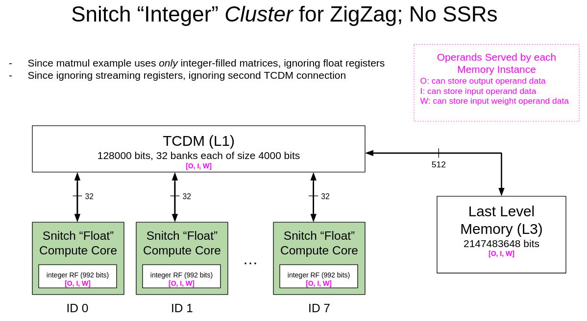

# Modeling Snitch Cluster with ZigZag

## Setup

1. Clone this forked ZigZag repo: `git clone https://github.com/EmilySillars/zigzag.git`

2. Make sure you can see remote branches: `git fetch origin`

3. Checkout this branch: `git checkout manual-examples`

4. Install dependencies

   - create conda environment:

     ```
     conda create -n zigzag-env python=3.11
     ```

   - install requirements inside the environment

     ```
     conda activate zigzag-env
     pip install -r requirements.txt
     ```

   - When you are finished using ZigZag, deactivate conda environment with

     ```
     conda deactivate zigzag-env
     ```

## Run

### I. Inputs needed

To run ZigZag, you need to specify a **hardware description**, a **workload**, a **default temporal and spatial mapping**, and a folder **location to dump the output**. We specify these file paths inside a `main.py` file that runs ZigZag.



- [Hardware Description](zigzag/inputs/hardware/snitch-cluster-only-integers.yaml)
- [Workload](zigzag/inputs/workload/matmul-104-x-104.yaml)
- [Default Mapping File](zigzag/inputs/mapping/snitch-cluster-empty-mapping.yaml)
- location to dump output: `outputs/`
- [main file](main_snitch_cluster_only_integers.py)

### II. Command to run:

```
python main_snitch_cluster_only_integers.py
```

### III. Output:

```

```

